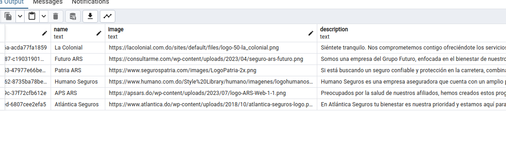

# Prerequisites

1. Docker
2. Terminal
3. Git

# Installation Guide

1. Run the docker-compose.yml passing the env variables via the command line.
2. ```bash
   $ POSTGRES_USER=(db_user) POSTGRES_PASSWORD=(db_password) DATABASE_URL=(db_postgresql_url) docker compose up -d
   ```

   > Sample PostgreSQLURL: postgresql://postgres:password@db:5432/postgres?schema=public docker compose up -d



The backend will be seeded with some default insurance companies.
